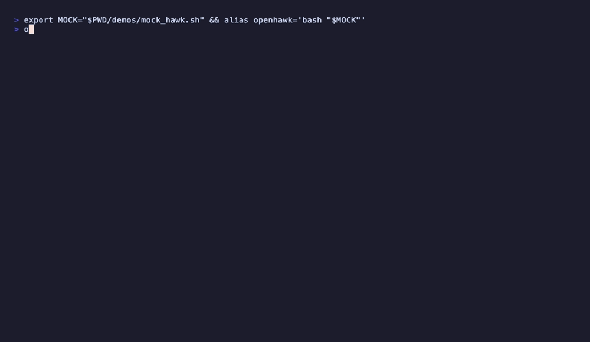
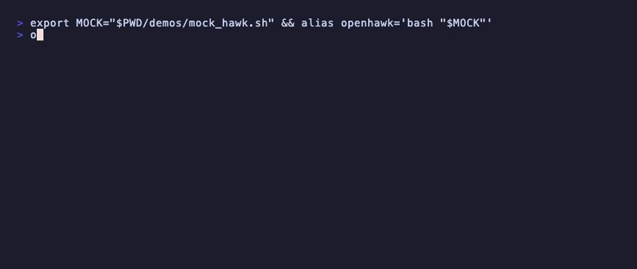
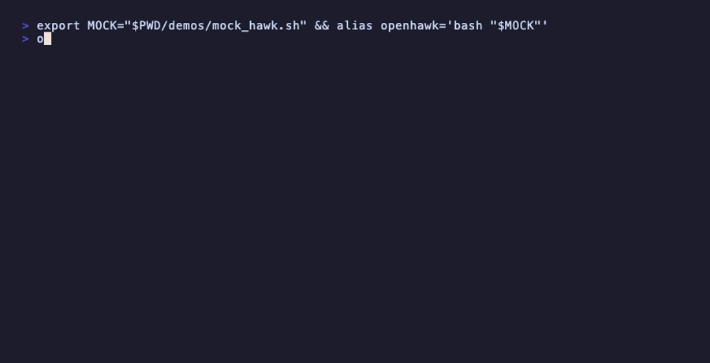
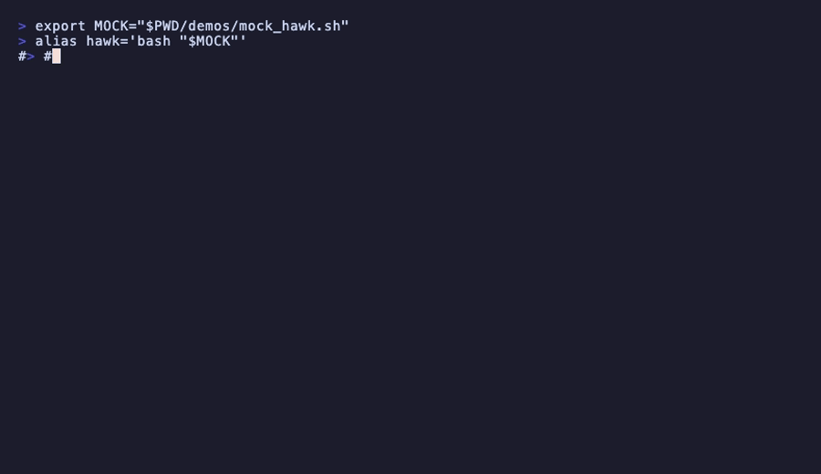
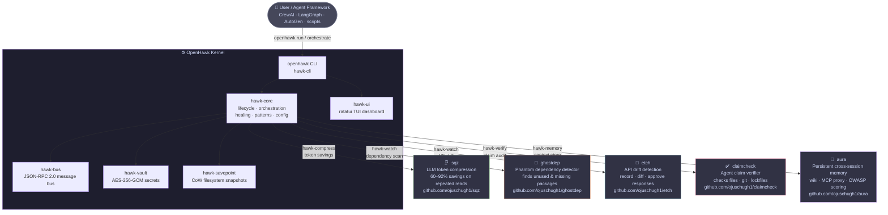

<p align="center"><pre>
 ██████╗ ██████╗ ███████╗███╗   ██╗██╗  ██╗ █████╗ ██╗    ██╗██╗  ██╗
██╔═══██╗██╔══██╗██╔════╝████╗  ██║██║  ██║██╔══██╗██║    ██║██║ ██╔╝
██║   ██║██████╔╝█████╗  ██╔██╗ ██║███████║███████║██║ █╗ ██║█████╔╝ 
██║   ██║██╔═══╝ ██╔══╝  ██║╚██╗██║██╔══██║██╔══██║██║███╗██║██╔═██╗ 
╚██████╔╝██║     ███████╗██║ ╚████║██║  ██║██║  ██║╚███╔███╔╝██║  ██╗
 ╚═════╝ ╚═╝     ╚══════╝╚═╝  ╚═══╝╚═╝  ╚═╝╚═╝  ╚═╝ ╚══╝╚══╝ ╚═╝  ╚═╝
</pre></p>

<p align="center"><strong>local-first Agent OS — manage AI agents like real processes</strong></p>

<p align="center">
  <a href="https://crates.io/crates/openhawk"></a>
  <a href="https://github.com/ojuschugh1/openhawk/blob/main/LICENSE"></a>
</p>

OpenHawk is a local-first Agent Operating System built in Rust. It manages AI agents as first-class OS processes — filesystem safety through Copy-on-Write snapshots, inter-agent communication over a JSON-RPC bus, per-agent permission sandboxing, encrypted secrets management, and a TUI dashboard for real-time observability.

Works with any agent framework: CrewAI, LangGraph, AutoGen, custom scripts, or anything that runs as a process.

---

## Demo

<p align="center">
  
</p>

---

## Install

The fastest way — no git clone needed:

```bash
cargo install openhawk
```

This puts the `openhawk` binary in `~/.cargo/bin/`. Make sure that's on your PATH:

```bash
export PATH="$HOME/.cargo/bin:$PATH"
```

Verify:

```bash
openhawk --help
```

On first run, OpenHawk checks for companion tools and prompts you to install them:

```bash
openhawk setup --yes
```

That installs sqz, ghostdep, claimcheck, etch, and aura into `~/.local/bin/`.

---

## Install from source

```bash
git clone https://github.com/ojuschugh1/openhawk
cd openhawk
cargo build --release
cargo install --path hawk-cli
```

Prerequisites: Rust 1.75+ from https://rustup.rs

---

## Companion tools

OpenHawk integrates with these tools for full functionality:

| Tool | What it does |
|---|---|
| sqz | LLM token compression — 60-92% savings on repeated reads |
| ghostdep | Phantom dependency detector |
| claimcheck | Agent claim verifier |
| etch | API drift detector |
| aura | Persistent cross-session memory |

```bash
openhawk setup          # check what's installed
openhawk setup --yes    # install missing tools
openhawk setup --only sqz --yes   # install one tool
openhawk setup --force --yes      # force reinstall all
```

---

## Platforms

- macOS 12+ (Apple Silicon and Intel)
- Linux (kernel 5.10+, x86_64 and aarch64)
- Windows 10+ (via WSL2 recommended)

---

## Quick start

```bash
openhawk run "python my_agent.py"          # spawn an agent
openhawk ps                                # list running agents
openhawk vault set OPENAI_API_KEY sk-...   # store a secret
openhawk orchestrate "research X then write Y then review it"
openhawk sdk init python --name my-agent --output ~/projects
openhawk stats tokens                      # token savings from sqz
```

---

## Secrets vault

Secrets are encrypted with AES-256-GCM and stored locally. Keys are derived from your system keychain via Argon2id with a random per-vault salt.

<p align="center">
  
</p>

```bash
openhawk vault set OPENAI_API_KEY sk-proj-abc123   # store
openhawk vault list                                 # list keys (never values)
openhawk vault get OPENAI_API_KEY                   # inject into environment
openhawk vault rm OPENAI_API_KEY                    # delete
```

---

## Agent lifecycle

Spawn any command as a managed agent — Python, Node, Rust, shell scripts, anything.

<p align="center">
  
</p>

```bash
openhawk run "python research_agent.py"
openhawk run "node my-agent/dist/index.js"
openhawk ps                  # live CPU and memory via sysinfo
openhawk pause 42981
openhawk resume 42981
openhawk stop 42981
openhawk undo                # roll back filesystem to last snapshot
openhawk verify sess-abc123  # verify agent claims against evidence
```

---

## Multi-agent orchestration

Decompose a task across agents. Use `and` for parallel subtasks, `then` for sequential.

<p align="center">
  
</p>

```bash
openhawk orchestrate "research quantum computing and write a summary then review it"
```

Dispatches real `task.run` messages over hawk-bus to each assigned agent and waits for `task.done` / `task.failed` replies (30s timeout). Falls back to local execution for agents without a bus client.

---

## Filesystem snapshots

OpenHawk snapshots the working directory before every agent task using OS-native CoW (APFS on macOS, Btrfs on Linux, file-copy fallback elsewhere).

```bash
openhawk undo <snapshot-id>    # roll back to a snapshot
openhawk diff <snapshot-id>    # show what changed
```

```
M  src/main.rs
A  src/new_file.rs
D  src/old_file.rs
```

---

## Configuration

```bash
openhawk config show                        # view effective config
openhawk config set privacy.mode air-gapped # set a value
openhawk config llm                         # show LLM provider status
```

Config file at `~/.hawk/config.toml`:

```toml
[core]
log_level = "info"
session_retention_days = 30

[privacy]
mode = "standard"   # or "air-gapped"

[llm]
providers = [
    { name = "ollama", endpoint = "http://localhost:11434", priority = 1 },
]

[savepoint]
auto_snapshot = true
max_snapshots_per_agent = 50

[healing]
max_retries = 3
enabled = true
```

---

## SDK scaffolding

```bash
openhawk sdk init rust       --name my-agent --output ~/projects
openhawk sdk init python     --name my-agent --output ~/projects
openhawk sdk init typescript --name my-agent --output ~/projects
```

Each scaffold includes `Agent_Manifest.toml`, an entry point with hawk-bus client, and the appropriate build config.

---

## Message bus

Agents communicate over a JSON-RPC 2.0 bus with pub/sub, direct messaging, and offline queuing.

```bash
openhawk bus inspect   # show active topics and queue depths
```

---

## Monitoring

```bash
openhawk watch report    # API drift + phantom dependency report
openhawk stats tokens    # real compression stats from sqz
openhawk stats cost      # per-agent token cost breakdown
openhawk ps              # live CPU% and memory per agent
```

---

## Cross-device sync

Sync agents and memory across devices over LAN. All data encrypted with AES-256-GCM.

```bash
openhawk sync enable "shared-secret"
openhawk sync select my-research-agent
openhawk sync select memory:research-namespace
openhawk sync status
openhawk sync resolve --strategy last-write   # or: manual, merge
```

---

## Pattern detection

OpenHawk detects repeated action sequences and offers to automate them.

```bash
openhawk patterns list
openhawk patterns accept <pattern-id>   # generates an Agent_Manifest
openhawk patterns decline <pattern-id>
openhawk patterns reset
```

---

## Self-healing

When an agent fails, OpenHawk rolls back to the most recent snapshot and retries up to `max_retries` times before escalating.

```bash
openhawk healing history <agent-pid>
openhawk healing status
```

---

## Talon plugins

```bash
openhawk talon install browser-talon
openhawk talon list
```

Talons are signature-verified before loading. A failing Talon is isolated and cannot crash the kernel.

---

## HawkNest marketplace

```bash
openhawk nest search "browser automation"
openhawk nest install browser-talon
openhawk nest publish ./my-agent/
```

---

## HawkEye TUI

```bash
openhawk eye
```

Keyboard shortcuts: `j`/`k` navigate, `Enter` open detail, `u` undo, `/` search, `Tab` switch panels, `q` quit.

---

## Session replay

```bash
openhawk replay <session-id>           # full session log
openhawk replay <session-id> --step 5  # state at step 5
```

---

## Air-gapped mode

```bash
openhawk config set privacy.mode air-gapped
```

All LLM requests route to local providers only (Ollama, llama.cpp). HawkNest uses local cache. All outbound network attempts are denied and logged.

---

## Architecture

OpenHawk is the kernel. The five companion tools are satellites — each does one job, OpenHawk wires them together.



### Companion tools

| Tool | Role in OpenHawk | Repo |
|---|---|---|
| **sqz** | `hawk-compress` calls `sqz compress` to shrink LLM context before it reaches the model. `hawk stats tokens` shows real sqz SQLite stats. | [ojuschugh1/sqz](https://github.com/ojuschugh1/sqz) |
| **ghostdep** | `hawk-watch` calls `ghostdep -p <path> -f json` to find phantom and unused dependencies. Results stored in SQLite, surfaced in `openhawk watch report`. | [ojuschugh1/ghostdep](https://github.com/ojuschugh1/ghostdep) |
| **etch** | `hawk-watch` calls `etch test --ci --format json` to detect API drift between recorded and live responses. | [ojuschugh1/etch](https://github.com/ojuschugh1/etch) |
| **claimcheck** | `hawk-verify` calls `claimcheck <transcript.jsonl>` to audit whether an agent actually wrote the files, made the git commits, and updated the lockfiles it claimed to. | [ojuschugh1/claimcheck](https://github.com/ojuschugh1/claimcheck) |
| **aura** | `hawk-memory` delegates to `aura memory add/get/ls/rm` for persistent cross-session context. Falls back to in-memory store when aura isn't running. | [ojuschugh1/aura](https://github.com/ojuschugh1/aura) |

All five tools are installed automatically by `openhawk setup --yes` and fall back gracefully when not present.

```
openhawk/
├── hawk-cli/        openhawk binary (clap CLI)
├── hawk-core/       kernel: lifecycle, orchestration, config, healing, patterns
├── hawk-savepoint/  CoW filesystem snapshots
├── hawk-vault/      AES-256-GCM encrypted secrets
├── hawk-bus/        JSON-RPC 2.0 message bus
├── hawk-memory/     shared memory (Aura bridge)
├── hawk-verify/     claim verification (ClaimCheck bridge)
├── hawk-compress/   token compression (sqz bridge)
├── hawk-watch/      API drift + dependency scanning (etch/ghostdep)
├── hawk-ui/         ratatui TUI dashboard
├── hawk-nest/       marketplace client
├── hawk-sync/       cross-device sync
└── hawk-sdk-rust/   SDK + Python/TypeScript scaffolding
```

---

## Agent manifest

```toml
[agent]
name = "research-agent"
version = "1.0.0"
framework = "langraph"
entry_command = "python research_agent.py"

[permissions]
filesystem = ["~/projects/research/**", "/tmp/hawk-scratch/**"]
network    = ["https://api.openai.com/*"]
commands   = ["curl", "python3"]
secrets    = ["OPENAI_API_KEY"]

[resources]
cpu_percent = 25
memory_mb   = 512
max_open_fds = 64

[llm]
provider      = "openai"
budget_tokens = 1000000

[capabilities]
tags = ["research", "summarization", "web-search"]
```

---

## Running tests

```bash
cargo test                          # all 492 tests
cargo test -p hawk-core             # specific crate
cargo test -p hawk-vault
cargo test -p hawk-bus
```

---

## Development

```bash
cargo build                         # debug
cargo build --release               # release
cargo install --path hawk-cli       # install from source
cargo install openhawk              # install from crates.io
```

Binary installs to `~/.cargo/bin/openhawk`.

---

## Data storage

```
~/Library/Application Support/hawk/hawk.db   SQLite (macOS)
~/.local/share/hawk/hawk.db                  SQLite (Linux)
~/.hawk/config.toml                          config
~/.hawk/vault.enc                            encrypted secrets
```

No data leaves your machine unless you explicitly enable sync or use cloud LLM providers.

---

## Command reference

```
openhawk run <cmd>                     spawn an agent
openhawk stop/pause/resume <pid>       lifecycle control
openhawk ps                            list agents with CPU/memory

openhawk undo [snapshot-id]            roll back filesystem
openhawk diff <snapshot-id>            show changes since snapshot

openhawk vault set/get/rm/list         secrets management

openhawk config show/set/llm           configuration

openhawk orchestrate <task>            multi-agent task decomposition
openhawk trust <agent>                 bypass permission checks

openhawk verify <session-id>           verify agent claims
openhawk replay <session-id>           replay session

openhawk bus inspect                   message bus status
openhawk watch report                  API drift + dependency report
openhawk stats tokens/cost             compression and cost stats

openhawk talon install/list            plugin management
openhawk nest search/install/publish   marketplace

openhawk sdk init <lang>               scaffold agent project
openhawk sync enable/select/status     cross-device sync
openhawk patterns list/accept/decline  pattern automation
openhawk healing history/status        self-healing events
openhawk eye                           TUI dashboard
openhawk setup [--yes] [--only <tool>] install companion tools
```

---

## License

MIT
